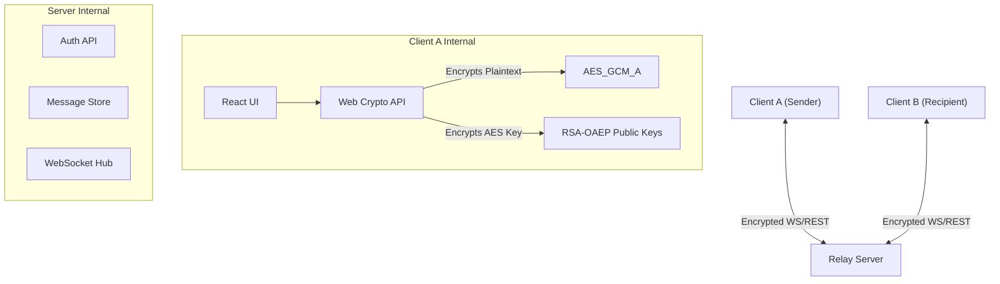

# WhisperBox - End-to-End Encrypted Messaging

WhisperBox is a secure, modern, and highly responsive end-to-end encrypted (E2EE) messaging application. Designed with privacy as the core tenet, the server acts purely as a relay—plaintext data never leaves the client, and the server cannot decrypt any messages.

## 🚀 Features

- **True End-to-End Encryption**: Messages are encrypted locally using AES-GCM and RSA-OAEP before transmission.
- **Zero-Knowledge Architecture**: The server only stores ciphertext. Private keys never leave the client device in plaintext.
- **Modern UI/UX**: Inspired by Telegram and macOS iMessage, featuring a sleek dark mode, glassmorphism, and smooth micro-animations.
- **Real-Time Delivery**: Messages are delivered instantly via WebSockets.
- **Offline Fallback**: Messages sent while the recipient is offline are securely stored as opaque blobs and delivered upon reconnection.
- **Session Locking**: On page reload, the session remains locked until the user re-enters their password to safely unwrap their private keys in-memory.

## 🏗️ System Architecture

The application is split into a frontend client (React/Vite) and a backend server (provided API).

### Architecture Diagram

### Encryption Flow

WhisperBox uses a **hybrid encryption scheme** for every message:

1. **Message Key Generation**: When a user sends a message, a random 256-bit AES-GCM key and a 96-bit IV are generated.
2. **Symmetric Encryption**: The plaintext message is encrypted with this AES-GCM key.
3. **Asymmetric Key Wrapping**: The AES-GCM key is then encrypted twice using RSA-OAEP:
   - Once with the recipient's public key (so they can read it).
   - Once with the sender's own public key (so the sender can view their own sent history).
4. **Transmission**: The resulting package (`ciphertext`, `iv`, `encryptedKey`, `encryptedKeyForSelf`) is transmitted to the server as an opaque blob.
5. **Decryption**: The receiving client uses their in-memory RSA private key to decrypt the `encryptedKey`, recovering the AES-GCM key, which is then used to decrypt the `ciphertext`.

### Key Management

- **RSA Keypair**: A 2048-bit RSA-OAEP keypair is generated upon registration.
- **Public Key**: Exported and stored on the server for others to fetch.
- **Private Key Storage**: The private key is **never** stored in plaintext. It is wrapped (encrypted) using an **AES-KW** key.
- **Wrapping Key Derivation**: The AES-KW key is derived from the user's plaintext password and a random 128-bit salt using **PBKDF2** (100,000 iterations).
- **Session Lifecycle**: 
  - On login, the client fetches the salt and wrapped private key.
  - The client re-derives the AES-KW wrapping key from the inputted password and unwraps the private key into a non-extractable in-memory `CryptoKey`.
  - If the page is refreshed, the in-memory key is lost. The user must use the "Session Unlock" screen to re-enter their password and unwrap the key again.

## 🛡️ Security Trade-offs & Limitations

### Trade-offs
- **In-Memory Keys vs. Persistence**: To prevent extraction via XSS, the unwrapped private key is kept strictly in React memory (not `localStorage`). The trade-off is that a page refresh requires the user to re-enter their password to unlock the session.
- **Metadata Visibility**: While the message content is fully encrypted, metadata (who is talking to whom, and at what time) is visible to the server to facilitate routing and history tracking.

### Known Limitations
- **Forward Secrecy**: The current protocol uses long-lived static RSA keys. If a user's private key is ever compromised, all past messages encrypted to that key could theoretically be decrypted (no Perfect Forward Secrecy, unlike the Double Ratchet Algorithm).
- **Device Syncing**: Since the private key is tied to the account password via wrapping, adding a new device requires the user to log in with their password. However, key rotation is not currently supported by the backend schema.

## 💻 Tech Stack
- React 18
- Vite
- Tailwind CSS v4
- Zustand (State Management)
- Web Crypto API (Native Browser Cryptography)
- Lucide React (Icons)
- React Router DOM
- Axios
